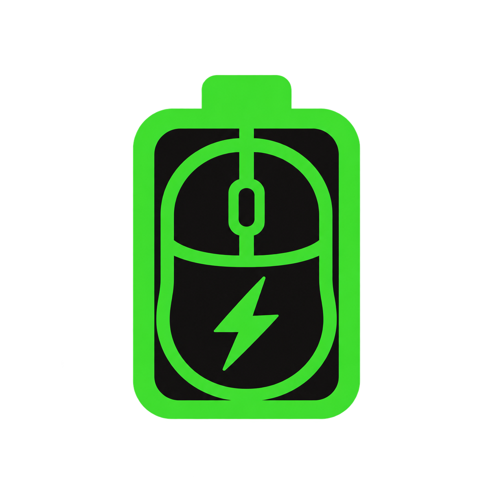

# Basilisk Battery

Um monitor leve de bateria para **Razer Basilisk V3 Pro e V3 Pro 35K**, na área de notificações do Windows 10/11 x64.



## Instalar e usar

Baixe o instalador na [release mais recente](https://github.com/luingry/razer-bzlskv3pro-battery-tracker/releases/latest). Instala por usuário, sem administrador e sem runtime adicional. Também existe um executável portátil.

Clique no ícone da bateria ou use o botão direito para abrir o menu. Ative **Iniciar com o Windows** se desejar; a primeira instalação deixa essa opção desativada. O menu também mostra a versão e permite atualizar a leitura ou sair. Se o Windows guardar o ícone na área oculta, abra a seta da bandeja e arraste-o para a área visível.

- **Verde:** 50% a 100%.
- **Amarelo:** 25% a 49%.
- **Vermelho:** menos de 25%.
- **Check:** 100%. **Cinza com `?`:** mouse ausente ou leitura indisponível.

A consulta ocorre a cada 30 segundos e após conexão/retomada. O tooltip informa carregamento quando disponível. O app não altera configurações do mouse e não exige Synapse.

## Compatibilidade

| Mouse | Cabo USB | Receptor wireless 2,4 GHz |
| --- | --- | --- |
| Basilisk V3 Pro | `1532:00AA` | `1532:00AB` |
| Basilisk V3 Pro 35K | `1532:00CC` | `1532:00CD` |

O 35K wireless foi testado fisicamente nesta primeira versão. Os demais transportes têm suporte implementado, mas exigem confirmação física. Bluetooth e Mouse Dock Pro não estão incluídos.

## Compilar

C++17 e APIs nativas Win32/GDI/HID, sem pacotes de runtime. O computador do usuário final não precisa de ferramentas de desenvolvimento.

Em **Developer PowerShell x64 do Visual Studio** com ferramentas C++/Windows SDK e Inno Setup 6:

```powershell
./scripts/build.ps1 -Installer
```

Alternativa: [w64devkit](https://github.com/skeeto/w64devkit), usando a pasta `bin`:

```powershell
./scripts/build.ps1 -Toolchain D:\Tools\w64devkit\bin -Installer
```

O script testa protocolo e limiares, compila o executável, verifica a versão e gera setup/checksum em `artifacts/`. Diagnóstico sem deixar processo residente:

```powershell
./build/BasiliskBattery.exe --diagnose artifacts/battery.json
./build/BasiliskBattery.exe --export-icons artifacts/icons
```

## Versões e manutenção

`VERSION` é a fonte única do número exibido no menu, arquivo e instalador. Atualize também `CHANGELOG.md` a cada entrega. O GitHub Actions compila e testa; um push em `main` com uma versão ainda não publicada cria automaticamente sua release com setup, portátil e SHA-256. Releases anteriores são preservadas.

As especificações estão em [docs/SPEC.md](docs/SPEC.md), as regras para agentes em [AGENTS.md](AGENTS.md) e os erros tratados em [ERRORS.md](ERRORS.md). A evidência da primeira versão está em [docs/VALIDATION.md](docs/VALIDATION.md).

Projeto independente, sem afiliação com a Razer. A logo foi gerada com o ChatGPT; detalhes em [docs/ASSETS.md](docs/ASSETS.md). Os IDs e o formato dos relatórios foram conferidos no [OpenRazer](https://github.com/openrazer/openrazer/blob/master/driver/razermouse_driver.c) e o comportamento do HID Windows no [HIDAPI](https://github.com/libusb/hidapi/blob/master/windows/hid.c); não foram incorporados drivers ou código desses projetos.
